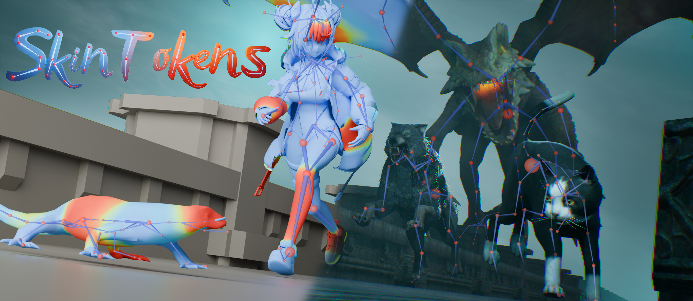

<p align="center">
  
</p>

<div align="center">

# ComfyUI-SkinTokens

**Automated 3D Rigging · Skinning Existing bones · Interactive FBX Preview**

[](https://www.python.org/)
[](https://github.com/comfyanonymous/ComfyUI)
[](https://discord.gg/k3uhp8vRk)

A ComfyUI implementation for automated character rigging can be used for animations simualations etc. featuring a headless Blender server and a  Three.js previewer.

</div>

---

### Installation

#### Method 1: ComfyUI Manager (Recommended)
1.  Open **ComfyUI Manager**.
2.  Click **"Custom Nodes Manager"**.
3.  Search for `ComfyUI-SkinTokens`.
4.  Click **Install** and restart ComfyUI.

#### Method 2: Manual Installation
1.  Open a terminal in your `ComfyUI/custom_nodes/` folder.
2.  Clone the repository:
    ```bash
    git clone https://github.com/Aero-Ex/ComfyUI-SkinTokens
    ```
3.  Navigate into the folder and run the installation script:
    ```bash
    cd ComfyUI-SkinTokens
    python install.py
    ```
4.  Restart ComfyUI.

### Requirements
*   **Blender 4.2+**: Must be installed and **added to your system PATH** (so that running `blender` in a terminal works). This is required for the Headless Blender Server.

### Generation Parameters

| Parameter | Default | Description |
| :--- | :--- | :--- |
| `--top_k` | `5` | Top-k sampling |
| `--top_p` | `0.95` | Top-p (nucleus) sampling |
| `--temperature` | `1.0` | Sampling temperature |
| `--repetition_penalty` | `2.0` | Repetition penalty |
| `--num_beams` | `10` | Number of beams for beam search |
| `--use_skeleton` | `False` | Use existing skeleton (generate skin only) |
| `--use_transfer` | `False` | Transfer original texture and scale |
| `--use_postprocess` | `False` | Apply voxel-based skin postprocessing |

### Support
If you encounter any issues or have questions, feel free to **open an issue** on the GitHub repository.

### 💖 Sponsor
If you find my work useful, please consider starring the repository and supporting my future projects:
**[Sponsor Aero-Ex on GitHub](https://github.com/sponsors/Aero-Ex)**

### 🤝 Acknowledgements
This project is based on the [SkinTokens](https://github.com/VAST-AI-Research/SkinTokens) research by VAST-AI-Research. We would like to thank the authors for their groundbreaking work in automated 3D rigging and skinning.
